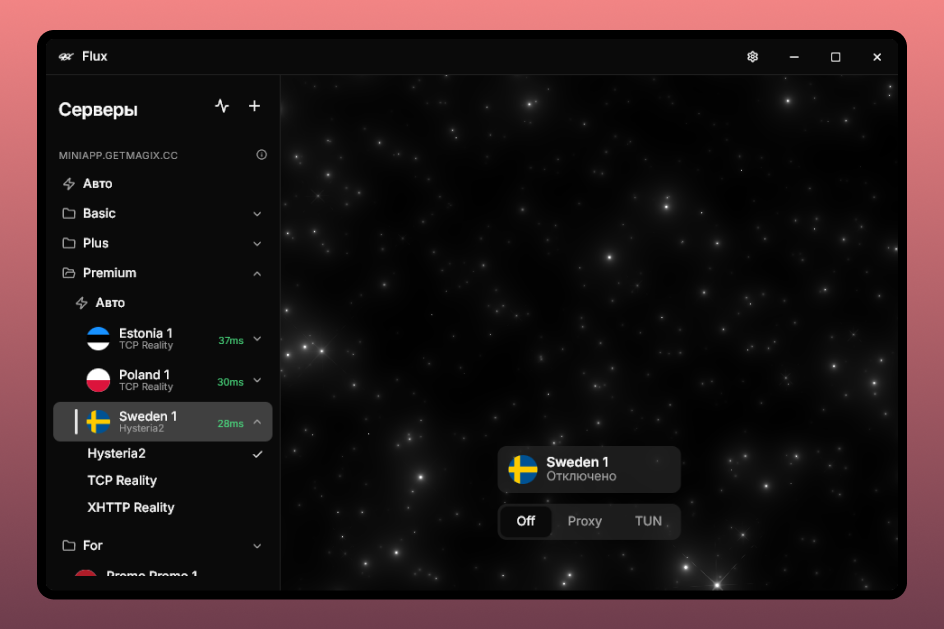
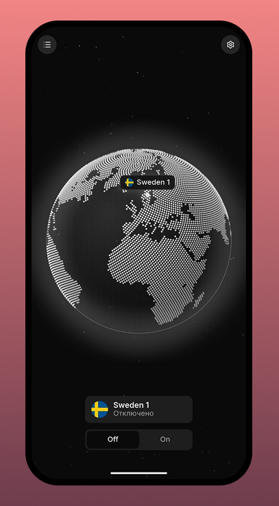

<div align="center">
  

  # Flux

  A cross-platform VLESS / Hysteria2 VPN client, built with Flutter.

  [](https://github.com/fllcker/flux-vpn-client/releases/latest)
  [](https://github.com/fllcker/flux-vpn-client/actions/workflows/release.yml)
</div>

<br />

<div align="center">
  
  
</div>

## What it is

Flux is a VLESS/Hysteria2 client for Windows and Android, powered by
[xray-core](https://github.com/XTLS/Xray-core) (and, on Windows TUN mode, a
[sing-box](https://github.com/SagerNet/sing-box) routing bridge alongside it).
It reads a "Magic JSON" profile — subscription URLs and/or standalone servers
— and gets you connected with a couple of clicks, either through a local
system proxy (Windows) or a full-device tunnel (Windows TUN / Android).

## Killer features

- **Server groups, not just a flat list.** Subscriptions auto-group into
  folders (by name, by tag — however the subscription itself organizes
  them), and you can drag-and-drop servers/groups to reorder or regroup by
  hand — manual layout survives subscription refreshes instead of getting
  wiped every time.
- **Routing rules per server or in bulk.** Send specific domains/IPs direct
  or block them, either on one server or applied across an entire
  subscription at once — no need to repeat the same rule 30 times.
- **"Magic JSON" profiles.** One JSON format covers subscriptions and
  standalone servers together, so sharing/backing up your whole setup — not
  just one link — is a single file. See `docs/` for the format.
- **Auto-pick-best-server.** Ping every server (through the proxy, raw TCP,
  or ICMP) and let Flux pick the lowest-latency one instead of guessing.
- **One codebase, real per-platform UX.** Same Flutter app on desktop and
  mobile, but the mobile layout isn't just a squeezed desktop window — no
  desktop window chrome, bottom sheets instead of side panels, floating
  actions, long-press-to-drag instead of instant-drag, etc.

## Other features

- **Protocols**: VLESS (TCP, XHTTP, TLS, Reality) and Hysteria2.
- **Subscriptions**: import by URL, auto-refresh, auto-grouping.
- **Connection modes**: system proxy or full TUN tunnel on Windows; a single
  device-wide TUN tunnel on Android (see [ROADMAP.md](ROADMAP.md), track 19,
  for how that's wired to the same xray-core engine).
- **Tray icon, autostart, and window state** on Windows.
- Dark theme, Russian/English localization.

## Platforms

| Platform | Status |
| --- | --- |
| Windows | ✅ Ready |
| Android | ✅ Ready |
| macOS | 🗓 Planned |
| Linux | 🗓 Planned |
| iOS | 🗓 Planned |

The core is deliberately built around a platform-agnostic `CoreEngine`
abstraction (config format, routing, subscriptions — all shared), so the
remaining platforms are "write the platform-specific engine glue", not "port
the app" — see `PLAN.md`.

## Download

Grab the latest Windows installer/portable build or Android APK from the
[Releases page](https://github.com/fllcker/flux-vpn-client/releases/latest).
Every release is built and signed by CI straight from a version bump in
`pubspec.yaml` — see `.github/workflows/release.yml`.

## Building from source

Requires the [Flutter SDK](https://docs.flutter.dev/get-started/install)
(stable channel).

### Windows

```powershell
./scripts/fetch_xray.ps1       # downloads xray-core into assets/xray/
./scripts/fetch_sing_box.ps1   # downloads sing-box into assets/sing-box/
flutter pub get
flutter build windows --release
```

An Inno Setup installer can be built afterwards with
`./scripts/build_installer.ps1` (needs [Inno Setup](https://jrsoftware.org/isinfo.php)).

### Android

xray-core has no official prebuilt Android library, so it's compiled from
source via [Go Mobile](https://pkg.go.dev/golang.org/x/mobile) against
[2dust/AndroidLibXrayLite](https://github.com/2dust/AndroidLibXrayLite) — the
same approach [v2rayNG](https://github.com/2dust/v2rayNG) uses. Requires Go,
`gomobile`/`gobind`, and the Android SDK/NDK.

```powershell
./scripts/build_android_xray.ps1   # builds libv2ray.aar into android/app/libs/
flutter pub get
flutter build apk --release
```

See `android/app/libs/SOURCE.md` for details on that build step.

## Tech stack

Flutter (Dart) UI with a hand-rolled shadcn/ui-inspired widget kit
(`lib/widgets/port_ui/`), Riverpod for state, and native platform code where
the engines live: `window_manager`/`tray_manager`/Win32 registry on Windows,
a Kotlin `VpnService` + Go-bound xray-core on Android.

## Roadmap

Development notes, design decisions, and what's next live in
[ROADMAP.md](ROADMAP.md).
